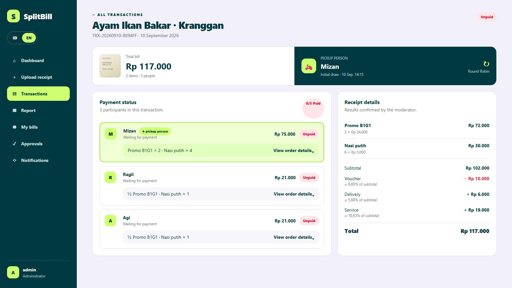
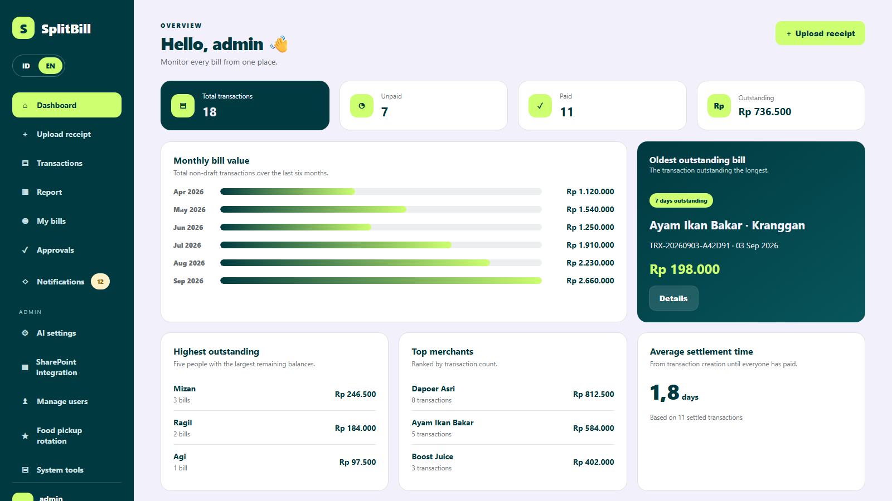
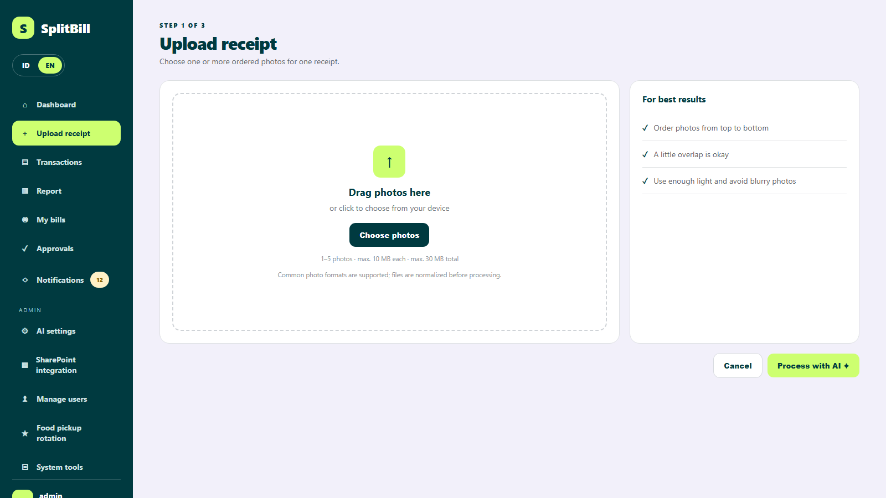
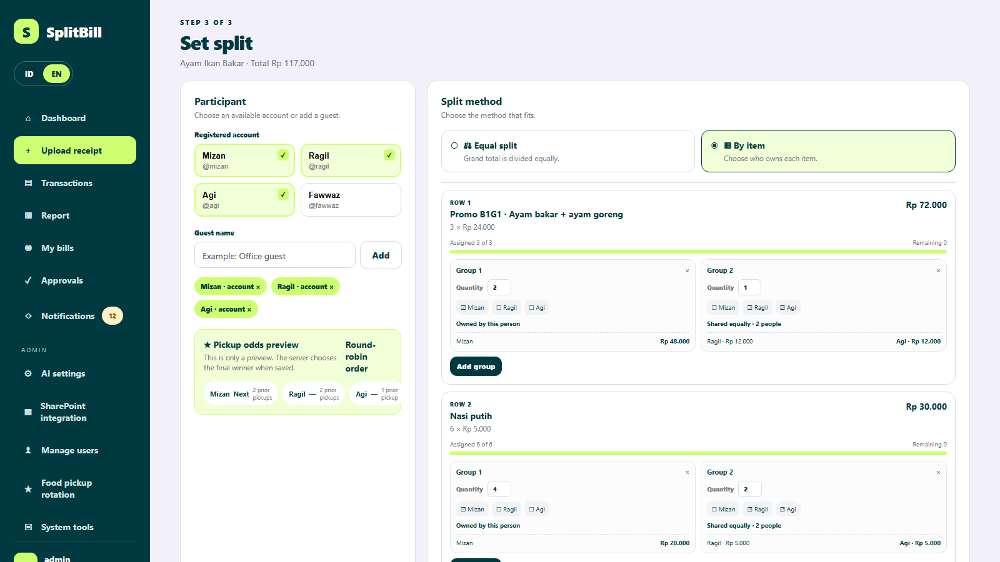
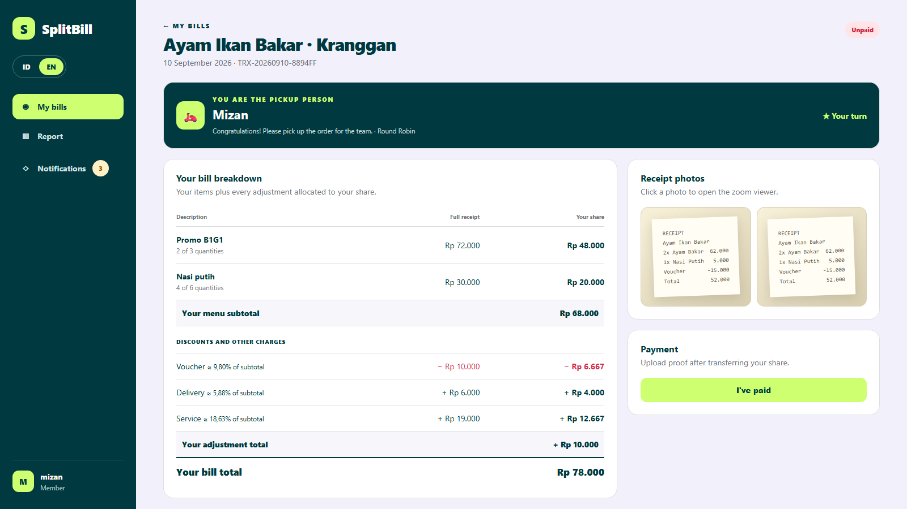
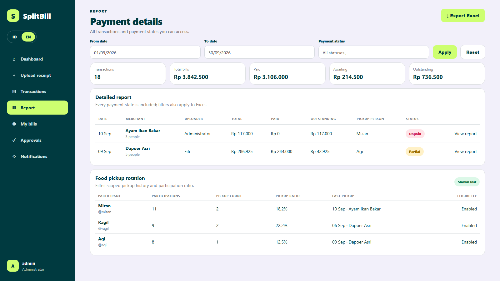
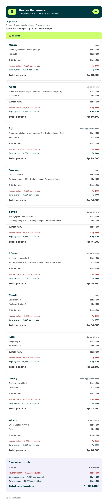
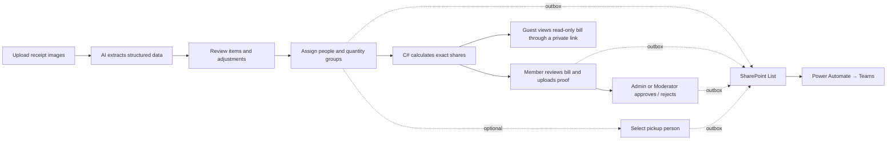

<div align="center">

# SplitBill

### Receipt photos in. Fair, transparent bills out.

AI extraction · Quantity-based splitting · Payment approval · Guest links · Multi-currency · Excel reports · Teams notifications


</div>

SplitBill is a self-hosted ASP.NET Core 8 application that turns one or more receipt photos into role-scoped, trackable split bills. AI reads the receipt, while deterministic C# code owns every amount, allocation, adjustment, and rounding decision.

<p align="center">
  <a href="documentation/screenshots/transaction-pickup.png">
    
  </a>
</p>

<p align="center"><sub><strong>One operational view:</strong> who ordered what, who owes what, who has paid, and who is picking up the food.</sub></p>

## See it in action

<table>
  <tr>
    <td width="50%" align="center">
      <a href="documentation/screenshots/dashboard.png"></a>
      <br><sub><strong>Source-aligned operational dashboard</strong></sub>
    </td>
    <td width="50%" align="center">
      <a href="documentation/screenshots/upload-receipt.png"></a>
      <br><sub><strong>Multi-image receipt upload</strong></sub>
    </td>
  </tr>
  <tr>
    <td width="50%" align="center">
      <a href="documentation/screenshots/split-assignment.png"></a>
      <br><sub><strong>Quantity groups and shared portions</strong></sub>
    </td>
    <td width="50%" align="center">
      <a href="documentation/screenshots/my-bill-details.png"></a>
      <br><sub><strong>Transparent Member breakdown</strong></sub>
    </td>
  </tr>
  <tr>
    <td colspan="2" align="center">
      <a href="documentation/screenshots/report-pickup.png"></a>
      <br><sub><strong>Complete reports and pickup history</strong></sub>
    </td>
  </tr>
</table>

<p align="center"><sub>Sanitized previews follow the current Razor views and CSS. The Dashboard image shows its top section; currency cards appear farther down the page. Click any image to open it at full size.</sub></p>

<details>
  <summary><strong>Open an actual long JPEG generated by the production Canvas renderer</strong></summary>
  <p align="center">
    <a href="documentation/screenshots/share-transaction-long.jpg">
      
    </a>
  </p>
  <p align="center"><sub>Sanitized 1000 × 4394 output with all 10 participants, item shares, adjustments, payment states, pickup person, and receipt reconciliation. Click the image for the original resolution.</sub></p>
</details>

## Features

| | Capability | Included behavior |
| --- | --- | --- |
| 📷 | **Safe receipt capture** | Upload 1–5 ordered raster images. The server validates decoded content, bounds dimensions, auto-orients, strips metadata, flattens transparency, and stores protected canonical JPEGs. |
| ✨ | **AI extraction** | OpenAI or Azure OpenAI, selectable models, `/responses` or `/chat/completions`, and retry with the same protected images when extraction fails. |
| 🧮 | **Flexible splitting** | Equal split or per-item assignment using whole-quantity groups, multi-item people, shared portions, guests, registered accounts, and promo bundles such as B1G1. |
| 🔎 | **Transparent math** | Members see their item shares, each allocated discount/fee, effective percentages, rounding, final amount, and receipt gallery with modal zoom. |
| ✅ | **Two-step payment** | Members upload proof and select **I've paid**; Admin or the owning Moderator approves, rejects with a reason, reopens, or marks payment directly. |
| 📊 | **Reports and Excel** | Role-scoped date/status filters, all payment states, per-person order detail, and four Excel sheets: Summary, Payment Details, Pivot by Person, and Pickup Rotation. |
| 🛵 | **Food pickup rotation** | Admin-managed eligibility, secure weighted random or deterministic Round Robin, participant-only candidates, stable winners, reasoned rerolls, and auditable history. |
| 💬 | **SharePoint + Teams** | Durable outbox events for bill assignment, payment approval, rejection, and pickup winner; Power Automate sends localized Teams messages with deep links. |
| 🖼️ | **One long share image** | Uploader or Admin shares all, selected, or one participant in a single readable 1000px JPEG; Members can share only their own bill, with HTTP download fallback. |
| 🔗 | **Guest access** | Account-free read-only personal and whole-transaction links with separate revocation. The Share dialog includes one whole-transaction link, guest-specific links, and the JPG tab for the uploader or Admin, even when every participant is a guest. |
| 💱 | **Multi-currency** | Bills stay payable in their receipt currency; a saved exchange-rate snapshot powers IDR reporting. Admin configures the provider and up to four current-rate cards on the operational dashboard. |
| 👥 | **Role and user management** | Admin has global access and user management, Moderator manages owned transactions, and Member sees only linked bills and shared report context. |
| 📈 | **Two dashboard experiences** | Admin/Moderator operational analytics and a private Member spending dashboard with monthly history, paid totals, and outstanding totals. |
| 📲 | **Installable PWA** | Responsive ID/EN interface, install prompt, static offline shell, and optional HTTPS browser push without caching authenticated pages or private images. |
| 💾 | **Backup and migration tools** | Password-confirmed Admin backup, checksummed restore packages, same-install validation, rollback support, and migration-mode secret reset. |

## Flow



## Quick start

SplitBill currently targets Windows because AI, Microsoft Entra, Web Push, and bootstrap secrets use machine-scope Windows DPAPI.

Requirements:

- [.NET 8 SDK](https://dotnet.microsoft.com/download/dotnet/8.0)
- Windows 10/11 or Windows Server
- OpenAI or Azure OpenAI credentials for receipt extraction
- Optional: IIS with the ASP.NET Core Hosting Bundle
- Optional: Microsoft Entra + SharePoint + Power Automate for Teams notifications

```powershell
git clone https://github.com/mizdodge/split-bills.git
cd split-bills
dotnet restore
dotnet run -- --print-bootstrap-code
dotnet run
```

Open `http://localhost:5081/setup`, enter the one-time bootstrap code, and create the first Admin. Fresh installations seed roles only; users are created from **Admin → Manage users**.

Configure the AI provider and encrypted API key from **Admin → AI settings**. Configure optional Microsoft Entra and SharePoint list discovery from **Admin → SharePoint integration**. Secrets never belong in `appsettings.json`.

## Build, test, and release

```powershell
dotnet build Splitbill.sln
dotnet test Tests\Splitbill.Tests.csproj
.\build-release.ps1
```

The release builder restores, builds, runs the full test suite, publishes Windows x64 output, checks the sanitized package, creates `SHA256SUMS.txt`, and writes a timestamped ZIP under `artifacts/`.

For IIS prerequisites, first installation, upgrades, permissions, backup, restore, and migration, follow the [Windows Server guide](documentation/guides/SERVER_SETUP.md).

## Technology

- ASP.NET Core 8 MVC, Razor Views, ASP.NET Core Identity
- Entity Framework Core 8 with SQLite
- OpenAI and Azure OpenAI via `/responses` or `/chat/completions`
- Bootstrap 5, application CSS, and vanilla JavaScript
- Magick.NET for bounded image decoding and normalization
- ClosedXML for typed Excel exports
- Microsoft Graph, SharePoint Lists, Power Automate, and Teams
- xUnit with isolated in-memory SQLite controller/service tests

## Documentation

- [Project guide](project_guide.md) — authoritative behavior, architecture, data model, security boundaries, and extension rules
- [Documentation index](documentation/README.md) — setup guides, security policy, and current interface screenshots
- [Windows Server and IIS setup](documentation/guides/SERVER_SETUP.md)
- [SharePoint and Power Automate setup](documentation/guides/SHAREPOINT_SETUP.md)
- [Currency and guest-link setup](documentation/guides/CURRENCY_AND_GUEST_SETUP.md)
- [Security policy](documentation/SECURITY.md)
- [Changelog](CHANGELOG.md)

## Security

Receipt images, payment proofs, SQLite data, backups, and Data Protection keys are private runtime data and must never be committed. Protected files stay outside `wwwroot` and are served only through authorized controller actions. All mutating actions are antiforgery-protected, and transaction access is enforced server-side for every role.

Before exposing SplitBill beyond a trusted private network, enable HTTPS, restrict server access, use strong credentials, and review the [security policy](documentation/SECURITY.md) and [deployment guide](documentation/guides/SERVER_SETUP.md).

## License

SplitBill is available under the [MIT License](LICENSE).

## Status

The current release gate passes **191 tests** with zero build warnings and zero errors. SplitBill is actively developed as a self-hosted application; practical feedback and contributions are welcome.
